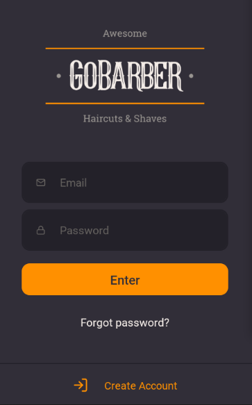
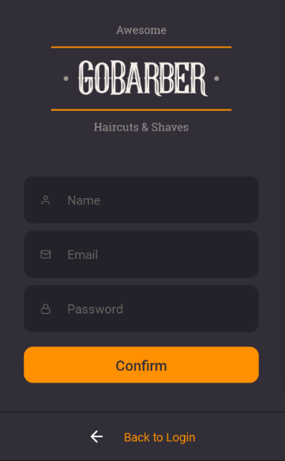

# GoBarber

### Login

***

### Create Account

***

## Requirements

- Package manager: Yarn/Npm;
- React Native(https://reactnative.dev/docs/getting-started);

## Steps

- Use yarn/npm to install dependencies;
- Start the app with 'yarn start';
- Compatible plataforms :
  - Emulator: 
    - Android Studio(https://developer.android.com/studio).
    
## Features

